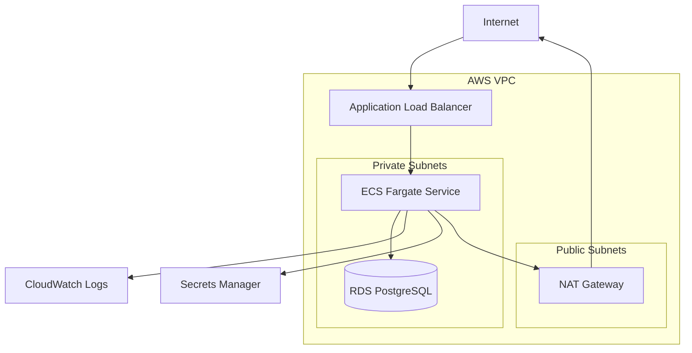

# Vikunja on AWS ECS Fargate

Terraform-based AWS infrastructure for running Vikunja on ECS Fargate with PostgreSQL, load balancing, private networking, secrets management, monitoring, and backup support.

## Architecture



## Overview

This project deploys the open-source task management application Vikunja on AWS using ECS Fargate.

The infrastructure is fully defined with Terraform and separates public and private workloads.

The Application Load Balancer is publicly reachable, while the ECS tasks and PostgreSQL database run inside private subnets.

The project also includes:

- AWS ECS Fargate
- Application Load Balancer
- Amazon RDS PostgreSQL
- AWS Secrets Manager
- CloudWatch Logs
- IAM roles and policies
- Public and private networking
- NAT Gateway
- Security Groups
- Automated RDS backups
- Infrastructure as Code with Terraform

## Architecture Flow

```text
Internet
   |
   v
Application Load Balancer
Port 80
   |
   v
ECS Fargate Service
Vikunja
Port 3456
   |
   v
Amazon RDS PostgreSQL
Port 5432
```

The ECS tasks and database are not directly accessible from the internet.

## Networking

The infrastructure uses a dedicated VPC:

```text
10.10.0.0/16
```

The VPC contains two public and two private subnets across multiple Availability Zones.

```text
VPC: 10.10.0.0/16

Public Subnet A:
10.10.1.0/24

Public Subnet B:
10.10.2.0/24

Private Subnet A:
10.10.11.0/24

Private Subnet B:
10.10.12.0/24
```

The public subnets contain the Application Load Balancer and NAT Gateway.

The private subnets contain the ECS Fargate workloads and Amazon RDS database.

## Public Networking

The public subnets use an Internet Gateway.

```text
Internet
   |
   v
Internet Gateway
   |
   v
Public Route Table
   |
   +--> Public Subnet A
   |
   +--> Public Subnet B
```

The public route table contains:

```text
0.0.0.0/0 -> Internet Gateway
```

## Private Networking

The ECS tasks require outbound internet access to retrieve container images and communicate with AWS services.

A NAT Gateway provides outbound connectivity without exposing the ECS tasks directly to the internet.

```text
Private Subnets
      |
      v
Private Route Table
      |
      v
NAT Gateway
      |
      v
Internet Gateway
      |
      v
Internet
```

The ECS tasks do not receive public IP addresses.

## Application Load Balancer

The Application Load Balancer is the public entry point for the application.

It listens on:

```text
HTTP Port 80
```

Requests are forwarded to the ECS Fargate tasks on:

```text
Port 3456
```

Traffic flow:

```text
Browser
   |
   v
ALB :80
   |
   v
Target Group
   |
   v
Vikunja :3456
```

The ALB uses two public subnets across different Availability Zones.

## ECS Fargate

Vikunja runs as a container using AWS ECS Fargate.

Fargate allows containers to run without managing EC2 instances.

The ECS cluster contains an ECS service which maintains the required number of running tasks.

```text
ECS Cluster
   |
   v
ECS Service
   |
   v
Fargate Task
   |
   v
Vikunja Container
```

The service currently uses:

```text
desired_count = 1
```

If the running task fails or is manually stopped, ECS automatically starts a replacement task.

## ECS Task Definition

The ECS Task Definition defines how the Vikunja container runs.

It includes:

- Container image
- CPU
- Memory
- Container port
- Environment variables
- Secrets
- CloudWatch logging

Current task resources:

```text
CPU: 256
Memory: 512 MB
Container Port: 3456
```

The Vikunja container image is currently:

```text
vikunja/vikunja:latest
```

For a final production-style version, the image should be pinned to a specific version instead of using `latest`.

## Database

The application uses Amazon RDS PostgreSQL for persistent storage.

The RDS database is located inside the private subnets.

The database is configured with:

```text
Engine: PostgreSQL
Instance class: db.t4g.micro
Storage: 20 GB gp3
Maximum storage: 50 GB
Public access: disabled
Multi-AZ: disabled
```

The database is not directly accessible from the internet.

Only the ECS Security Group can connect to PostgreSQL.

## Persistence

Application data is stored in Amazon RDS rather than inside the ECS container.

This means ECS tasks can be replaced without losing application data.

Example:

```text
Old ECS Task
   |
   X
Task stopped

ECS Service
   |
   v
New ECS Task
   |
   v
Same RDS database
   |
   v
Existing application data
```

## Security Groups

The infrastructure uses separate Security Groups for each layer.

### ALB Security Group

Allows:

```text
Internet -> ALB :80
```

### ECS Security Group

Allows:

```text
ALB -> ECS :3456
```

The ECS application port is not open directly to the internet.

### RDS Security Group

Allows:

```text
ECS -> RDS :5432
```

PostgreSQL is only reachable from the ECS Security Group.

## Security Flow

```text
Internet
   |
   | HTTP :80
   v
ALB Security Group
   |
   | TCP :3456
   v
ECS Security Group
   |
   | PostgreSQL :5432
   v
RDS Security Group
```

Allowed:

```text
Internet -> ALB
ALB -> ECS
ECS -> RDS
```

Blocked:

```text
Internet -> ECS
Internet -> RDS
```

## Secrets Management

Sensitive values are stored in AWS Secrets Manager.

The project currently stores:

```text
VIKUNJA_DATABASE_PASSWORD
VIKUNJA_SERVICE_SECRET
```

These values are injected into the ECS container at runtime.

The credentials are not hard-coded inside the Terraform configuration.

The ECS execution role has permission to retrieve only the required secrets.

## IAM

The ECS tasks use an IAM execution role.

The role allows ECS to perform required operations such as:

- Retrieve container images
- Send application logs to CloudWatch
- Retrieve application secrets from AWS Secrets Manager

A dedicated policy provides permission to access only the required Secrets Manager resources.

## CloudWatch Logging

Vikunja container logs are sent to Amazon CloudWatch Logs.

The Terraform configuration creates the log group:

```text
/ecs/vikunja-fargate
```

Log retention is configured to automatically remove old logs after the defined retention period.

CloudWatch logs can be used to troubleshoot:

- Container startup failures
- Database connection errors
- Configuration errors
- Application crashes
- Runtime errors

## Monitoring

The infrastructure can be monitored using AWS CloudWatch and ECS metrics.

Important operational checks include:

- ECS running task count
- ECS CPU utilization
- ECS memory utilization
- ALB target health
- ALB HTTP errors
- RDS CPU utilization
- RDS storage utilization
- Application logs

Additional monitoring and alarms can be added later.

## Health Checks

The Application Load Balancer checks whether the Vikunja container is healthy.

The Target Group health check uses:

```text
Protocol: HTTP
Port: 3456
Path: /
```

A healthy deployment should show:

```text
Target status: healthy
```

## Backup

Amazon RDS provides automated database backups.

The current lab configuration keeps automated backups for:

```text
1 day
```

The retention period is limited by the current AWS account plan.

Manual RDS snapshots can also be created.

## Backup Test

A backup test should be performed using the following process:

1. Create test data inside Vikunja
2. Create a manual RDS snapshot
3. Wait until the snapshot becomes available
4. Record the snapshot identifier
5. Modify or delete application data
6. Restore a new RDS instance from the snapshot
7. Verify that the previous data can be recovered

Detailed steps are documented in:

```text
docs/backup-restore.md
```

## Recovery Test

The project should also verify ECS recovery behavior.

Test procedure:

1. Open the ECS service
2. Identify the running task
3. Stop the task
4. Wait for ECS to create a replacement
5. Verify that the new task reaches `RUNNING`
6. Verify that the ALB reports the new target as healthy
7. Verify that existing Vikunja data is still available

Expected result:

```text
Task stopped
   |
   v
ECS detects missing task
   |
   v
New Fargate task starts
   |
   v
Application reconnects to RDS
   |
   v
Existing data remains available
```

## Project Structure

```text
.
├── docs
│   ├── architecture.md
│   ├── backup-restore.md
│   ├── deployment.md
│   ├── monitoring.md
│   └── troubleshooting.md
│
├── terraform
│   ├── alb.tf
│   ├── ecs.tf
│   ├── iam.tf
│   ├── monitoring.tf
│   ├── networking.tf
│   ├── outputs.tf
│   ├── provider.tf
│   ├── rds.tf
│   ├── secrets.tf
│   ├── security.tf
│   └── variables.tf
│
├── .gitignore
└── README.md
```

## Technologies

| Technology | Purpose |
|---|---|
| AWS ECS | Container orchestration |
| AWS Fargate | Serverless container compute |
| Application Load Balancer | Public application entry point |
| Amazon RDS | Managed PostgreSQL database |
| AWS Secrets Manager | Secure secret storage |
| Amazon CloudWatch | Logging and monitoring |
| AWS IAM | Permissions and access control |
| AWS VPC | Network isolation |
| NAT Gateway | Outbound internet access for private workloads |
| Terraform | Infrastructure as Code |
| Vikunja | Open-source application |

## Terraform

The complete AWS infrastructure is managed using Terraform.

Terraform defines:

- VPC
- Subnets
- Route Tables
- Internet Gateway
- NAT Gateway
- Security Groups
- Application Load Balancer
- Target Group
- ALB Listener
- ECS Cluster
- ECS Task Definition
- ECS Service
- RDS PostgreSQL
- IAM Roles
- IAM Policies
- Secrets Manager
- CloudWatch Logs

## Terraform Initialization

Navigate to the Terraform directory:

```bash
cd terraform
```

Initialize Terraform:

```bash
terraform init
```

## Terraform Validation

Format the Terraform files:

```bash
terraform fmt
```

Validate the configuration:

```bash
terraform validate
```

Preview infrastructure changes:

```bash
terraform plan
```

These commands can also be executed together:

```bash
terraform fmt && terraform validate && terraform plan
```

## Sensitive Variables

Sensitive variables are passed through environment variables.

Database password:

```bash
export TF_VAR_db_password='<database-password>'
```

Vikunja service secret:

```bash
export TF_VAR_vikunja_service_secret='<service-secret>'
```

These values are not committed to Git.

## Deploy Infrastructure

Deploy the environment:

```bash
terraform apply
```

Terraform displays the planned changes.

Confirm with:

```text
yes
```

Terraform then creates the AWS infrastructure.

## Terraform Outputs

After a successful deployment:

```bash
terraform output
```

Available outputs include:

```text
alb_dns_name
ecs_cluster_name
rds_endpoint
vpc_id
```

Retrieve only the Application Load Balancer DNS name:

```bash
terraform output alb_dns_name
```

The application can then be opened using:

```text
http://<alb-dns-name>
```

## Deployment Validation

After deployment, verify:

- Terraform completed successfully
- RDS status is available
- ECS task status is RUNNING
- ECS desired count equals running count
- ALB Target Group shows healthy
- Vikunja opens through the ALB DNS name
- CloudWatch contains application logs
- Vikunja can connect to PostgreSQL
- Application data persists after an ECS task replacement

## Troubleshooting

A useful troubleshooting flow is:

```text
Application unavailable
        |
        v
Check ALB target health
        |
        v
Check ECS service
        |
        v
Check ECS task status
        |
        v
Check CloudWatch logs
        |
        v
Check Security Groups
        |
        v
Check database connectivity
        |
        v
Check RDS status
```

Detailed troubleshooting notes are stored in:

```text
docs/troubleshooting.md
```

## Useful Terraform Commands

Format Terraform:

```bash
terraform fmt
```

Validate Terraform:

```bash
terraform validate
```

Create an execution plan:

```bash
terraform plan
```

Deploy:

```bash
terraform apply
```

Show outputs:

```bash
terraform output
```

List Terraform-managed resources:

```bash
terraform state list
```

Destroy the infrastructure:

```bash
terraform destroy
```

## Cost Management

Several resources generate AWS costs while running.

Important cost-generating resources include:

- ECS Fargate
- Application Load Balancer
- NAT Gateway
- Amazon RDS
- AWS Secrets Manager
- CloudWatch

The environment should be destroyed after testing when it is no longer required.

```bash
terraform destroy
```

This removes the Terraform-managed infrastructure and prevents unnecessary ongoing costs.

## Planned Improvements

Possible future improvements include:

- HTTPS using AWS Certificate Manager
- Custom domain using Route 53
- Fixed Vikunja container version instead of `latest`
- CloudWatch alarms
- Automated Terraform CI pipeline
- Terraform remote state
- S3 backend with state locking
- Multi-AZ database deployment
- Higher backup retention
- More advanced disaster recovery testing

## Status

Infrastructure deployment and validation in progress.

Current implementation includes:

- Terraform infrastructure
- VPC networking
- Public and private subnets
- NAT Gateway
- Application Load Balancer
- ECS Fargate
- RDS PostgreSQL
- Secrets Manager
- IAM
- CloudWatch logging
- RDS backups

Remaining validation includes:

- Application availability
- ALB health check
- Database connectivity
- Data persistence
- ECS task replacement
- Backup and restore testing
- Monitoring validation