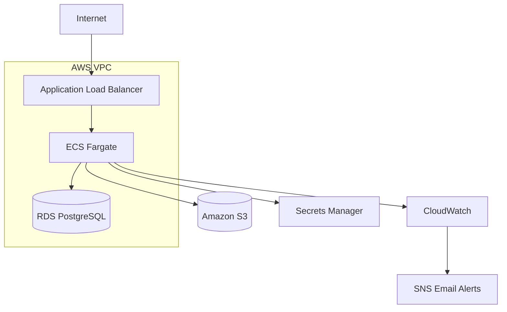

# Vikunja on AWS ECS Fargate

AWS infrastructure project for running Vikunja on ECS Fargate with Terraform.

The project focuses on cloud infrastructure, container operations, networking, security, monitoring, persistence, backup and recovery, and Infrastructure as Code.

## Architecture



## Tech Stack

- AWS ECS Fargate
- Application Load Balancer
- Amazon RDS PostgreSQL
- Amazon S3
- AWS VPC
- Public and private subnets
- NAT Gateway
- Security Groups
- IAM
- AWS Secrets Manager
- CloudWatch Logs & Alarms
- Amazon SNS
- AWS Budgets
- Terraform
- GitHub Actions

## Infrastructure

The Application Load Balancer is the public entry point.

ECS Fargate tasks and PostgreSQL run in private subnets.

```text
Internet
   |
   v
Application Load Balancer :80
   |
   v
ECS Fargate :3456
   |
   +--> RDS PostgreSQL :5432
   |
   +--> Amazon S3
```

ECS uses a NAT Gateway for outbound internet access without exposing the tasks directly to the internet.

## Persistence

Persistent data is stored outside the ECS container:

- Application data -> Amazon RDS PostgreSQL
- File attachments -> Amazon S3

This allows ECS tasks to be replaced without losing application data or uploaded files.

## Security

- ECS and RDS are not publicly accessible
- ALB-to-ECS traffic is restricted by Security Groups
- PostgreSQL access is restricted to the ECS Security Group
- S3 public access is blocked
- Secrets are stored in AWS Secrets Manager
- IAM permissions are limited to required resources

## ECS Fargate

Vikunja runs as an ECS Fargate service.

Task resources:

```text
CPU:    256
Memory: 512 MB
Port:   3456
```

The container image is pinned to a SHA256 digest instead of using `latest` to keep deployments reproducible.

The ECS service automatically replaces failed or manually stopped tasks.

## Monitoring & Alerting

CloudWatch Logs collect application logs.

CloudWatch alarms monitor:

- ECS CPU utilization
- ECS memory utilization
- ALB unhealthy targets
- ALB target 5xx errors
- RDS CPU utilization
- RDS free storage

Alarm state changes are delivered by email through Amazon SNS.

An AWS monthly budget is configured for cost monitoring.

## Backup & Recovery

A complete RDS snapshot restore was tested successfully.

Test procedure:

1. Created test data in Vikunja
2. Created a manual RDS snapshot
3. Deleted the test data
4. Restored a temporary RDS instance from the snapshot
5. Connected Vikunja to the restored database
6. Verified that the deleted data was recovered
7. Switched back to the live database
8. Deleted the temporary restore resources

## Failure & Persistence Testing

ECS recovery was tested by manually stopping the running task.

ECS automatically created a replacement task and the application recovered successfully.

S3 persistence was also tested:

- Uploaded an attachment to Vikunja
- Verified the object in S3
- Stopped the running ECS task
- Waited for ECS replacement
- Verified that the attachment was still available

## Terraform

Terraform manages the AWS infrastructure.

```bash
cd terraform

terraform init
terraform fmt
terraform validate
terraform plan
terraform apply
```

Terraform state is stored remotely in an encrypted and versioned S3 backend with state locking.

## Terraform CI

GitHub Actions validates the Terraform configuration automatically.

The workflow runs:

```text
terraform fmt -check -recursive
terraform init -backend=false
terraform validate
```

Infrastructure deployment remains manual.

## Project Structure

```text
.
├── .github/
│   └── workflows/
│       └── terraform.yml
│
├── docs/
│   ├── architecture.md
│   ├── backup-restore.md
│   ├── deployment.md
│   ├── monitoring.md
│   └── troubleshooting.md
│
├── terraform/
│   ├── alb.tf
│   ├── budget.tf
│   ├── ecs.tf
│   ├── iam.tf
│   ├── monitoring.tf
│   ├── networking.tf
│   ├── outputs.tf
│   ├── provider.tf
│   ├── rds.tf
│   ├── s3.tf
│   ├── secrets.tf
│   ├── security.tf
│   ├── sns.tf
│   └── variables.tf
│
└── README.md
```

## Validated

- Terraform deployment
- Infrastructure teardown and rebuild
- ECS automatic task recovery
- RDS persistence
- S3 attachment persistence
- RDS snapshot restore
- CloudWatch monitoring
- SNS email alerting
- AWS cost monitoring
- Terraform CI
- Remote Terraform state

## Possible Improvements

- HTTPS with AWS Certificate Manager
- Route 53 custom domain
- ECS Auto Scaling
- Multi-AZ RDS
- Higher backup retention
- Separate dev/staging/prod environments

## Status

Infrastructure implementation and operational validation completed.